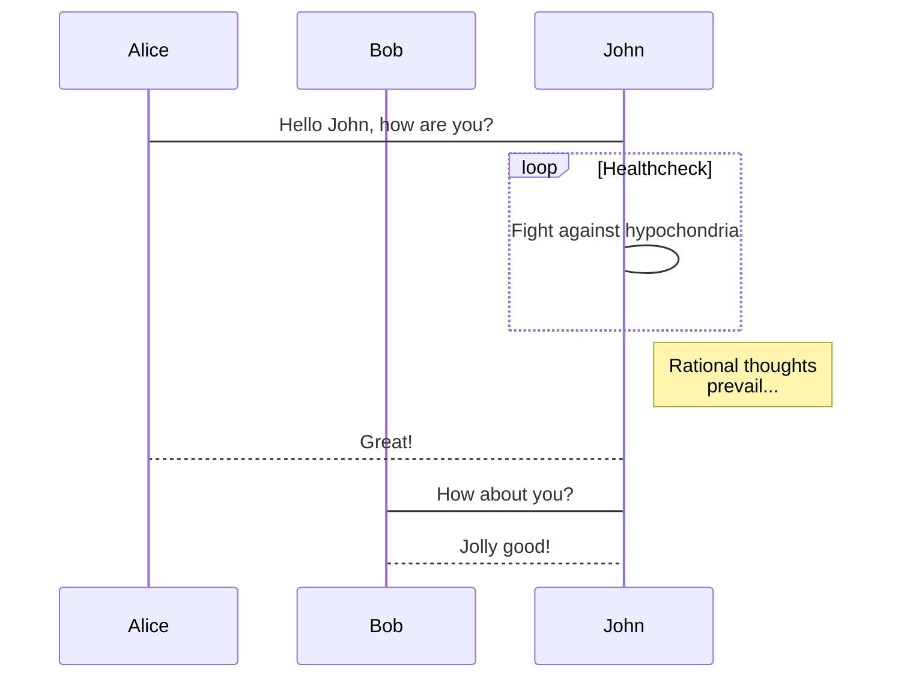

# 程序员的 Markdown

#### 2018-12-17

tags: Markdown,

### 使用插件

- [react-markdown](https://github.com/rexxars/react-markdown) react 的 markdown 显示组件
- [highlight](https://highlightjs.org/) Web 的语法突出显示
- [mermaid](https://mermaidjs.github.io/) 生成流程图
- [chart](https://www.chartjs.org/docs/) 生成图表，线图，箱体图等
- [react-emoji-render](https://github.com/tommoor/react-emoji-render) Emoji 表情包

#### 待添加

> [http://asciimath.org/](http://asciimath.org/) 算法公式

---

## Markdown

使用 react-markdown 插件，通过传入 renderers 道具可以方便定制自己的渲染，这里只做一些简单的演示，具体可以查看我的[blog 源码](https://github.com/zuotang/MyBlog/tree/master/src/components/markdown)。
把 markdown 封装成组件，方便复用.
com/Markdown.jsx

```js
import ReactMarkdown from 'react-markdown';

function Markdown({children, ...props}) {
  return <ReactMarkdown>{children}</ReactMarkdown>;
}
```

编写自定义渲染元素，具体参考[nodeTypes](https://github.com/rexxars/react-markdown#node-types)。一个对象，值为 react 组件
com/renders.jsx

```js
//流程图
import Graph from './Graph';
//代码块
import Code from './Code';
//图表
import Chat from './Chat';
//表情包
import Emoji from 'react-emoji-render';

const renderers = {
  text: props => <Emoji text={props.children} />,
  code: props => {
    switch (props.language) {
      case 'mermaid':
        return <Graph {...props} />;
      case 'chart':
        return <Chart {...props} />;
      default:
        return <Code {...props} />;
    }
  },
  link: props => <a href={props.href}>{props.children}</a>,
};
```

### Emoji

使用'react-emoji-render'插件，只需要把内容传入 text 道具即可

### Chart

```js
import React, {useEffect, useRef} from 'react';
import Chart from 'chart.js';

function Chart(props) {
  let chartRef = useRef();
  useEffect(() => {
    var ctx = chartRef.current.getContext('2d');
    new Chart(ctx, JSON.parse(props.value));
  });
  return <canvas ref={chartRef} id="myChart" width="400" height="400" />;
}
```

### Code

代码高亮插件

```js
import React, {useEffect, useRef} from 'react';
import hljs from 'highlight.js';
import 'highlight.js/styles/atom-one-dark.css';

function Code(props) {
  let codeRef = useRef();
  useEffect(() => {
    hljs.highlightBlock(codeRef.current);
  });
  return (
    <pre>
      <code ref={codeRef} className={`language-${props.language}`}>
        {props.value}
      </code>
    </pre>
  );
}
```

### Graph

流程图组件， 每次 render 都生成一个新的 name，让热加载时可以刷新显示。

```js
import React from 'react';
import mermaid from 'mermaid';
import SnackbarContent from '@material-ui/core/SnackbarContent';

// 语法错误处理
function ErrorSnackBar({message}) {
  // 使用material-ui提示组件
  return <SnackbarContent message={message} />;
}

function Graph(props) {
  try {
    mermaid.parse(props.value);
  } catch (err) {
    return <ErrorSnackBar message={err.str} />;
  }
  // 每次生成一个新的name，热加载时可以刷新显示
  let name = parseInt(Math.random() * 10000);
  let html = mermaid.render(`graph_${name}`, props.value);
  return <div dangerouslySetInnerHTML={{__html: html}} />;
}
```

---

# 效果展示

## Emoji: :panda_face: :sparkles: :camel: :boom: :pig:

[emoji 参考](https://www.webpagefx.com/tools/emoji-cheat-sheet/)

### Mermaid




### Chart

```chart
{
  "type": "bar",
  "data": {
  "labels": [
    "Red",
    "Blue",
    "Yellow",
    "Green",
    "Purple",
    "Orange"
  ],
  "datasets": [
    {
    "label": "# of Votes",
    "data": [
      12,
      19,
      3,
      5,
      2,
      3
    ],
    "backgroundColor": [
      "rgba(255, 99, 132, 0.2)",
      "rgba(54, 162, 235, 0.2)",
      "rgba(255, 206, 86, 0.2)",
      "rgba(75, 192, 192, 0.2)",
      "rgba(153, 102, 255, 0.2)",
      "rgba(255, 159, 64, 0.2)"
    ],
    "borderColor": [
      "rgba(255,99,132,1)",
      "rgba(54, 162, 235, 1)",
      "rgba(255, 206, 86, 1)",
      "rgba(75, 192, 192, 1)",
      "rgba(153, 102, 255, 1)",
      "rgba(255, 159, 64, 1)"
    ],
    "borderWidth": 1
    }
  ]
  },
  "options": {}
}
```
